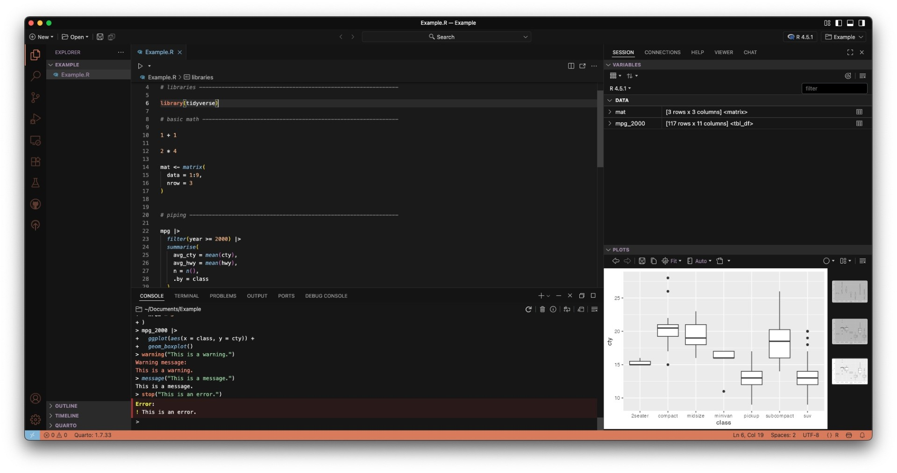

# Conversational Dark

A modern dark theme for [Visual Studio Code](https://code.visualstudio.com/) and [Positron](https://positron.app/), inspired by conversational AI interfaces (like Claude).  
Balanced contrasts, warm highlights, and subtle accents designed for long coding sessions without eye strain.

  

---

## Features
- **Dark base** background with soft gray text for readability.  
- **Warm accents** inspired by AI chat UIs (violets, teals, and soft ambers).  
- **Explorer & Sidebar** use muted colors (`#9d88a8`) so large file trees are easy on the eyes.  
- **Active Tab Highlighting**: current file name stands out in violet, inactive tabs stay neutral.  
- **Syntax highlighting** tuned for:
  - Keywords in bold orange-red (`#d97757`)
  - Strings in green (`#90c695`)
  - Numbers in amber (`#e8a87c`)
  - Functions in soft blue (`#7eb6d9`)
  - Comments in italic gray (`#888888`)

---

## Installation

### From Open VSX (Positron, VSCodium, etc.)
1. Open the Extensions view (`Ctrl+Shift+X` or `Cmd+Shift+X` on macOS).
2. Search for **Conversational Dark**.
3. Click **Install**.

---

## Usage

After installation:

1. Open the **Command Palette** (`Ctrl+Shift+P` or `Cmd+Shift+P`).
2. Search for `Preferences: Color Theme`.
3. Choose **Conversational Dark**.

---

## Contributions

Contributions are welcome! If you find any issues or have suggestions:

1. Fork the repository
2. Create a feature branch (`git checkout -b feature/improvement`)
3. Make your changes
4. Test with various file types
5. Submit a pull request

---

## License

MIT license - see [LICENSE](LICENSE) file for details.